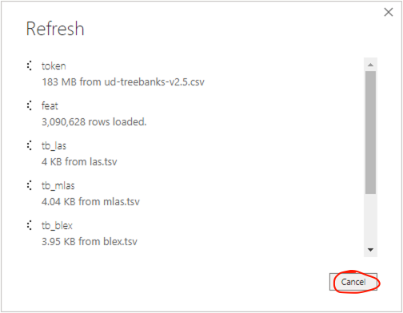
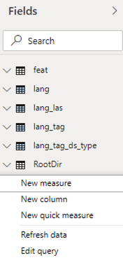
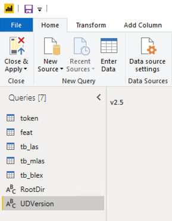
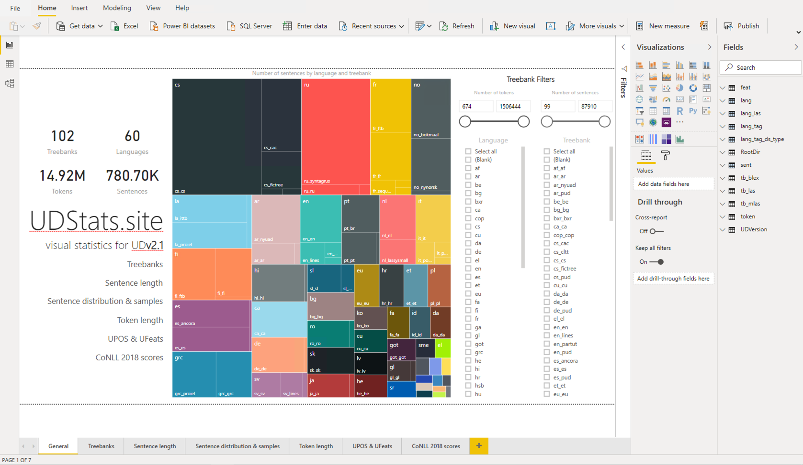

# Contributing

## How to edit dashboard locally?

#### 1. Preprocess Universal Depencencies

Clone repository and execute the `run.py` python script in order to convert one of Universal Dependency version archives to CSV. The conversion script merges all the treebanks from the archive, precalculates simple metrics and outputs a single CSV file as a result. 

```
python dashboard/run.py [ud_version [ud_url]]
```

* `ud_version` is a string in form of vX.X, i.e. *v2.5*, *v2.4*
* `ud_url` is optional uri pointing to .tgz repository

Output CSV files are placed in `dashboard/.tmp` directory. They are encoded in UTF-8. Each row represents one token in treebank. The columns of the file are:

* *1, lang* - language of a treebank, encoded as 2-character ISO code
* *2, tag* - source specific tag / name of the treebank
* *3, ds_type* - dataset type, one of *train* / *dev* / *test*
* *4, sent* - sequential number uniquely identifying sentences in CSV file
* *5, token* - sequential number uniquely identifying tokens in CSV file
* columns sourced directly from [CoNLL-U file standard](https://universaldependencies.org/format.html)
  * *6, id*
  * *7, form*
  * *8, lemma*
  * *9, upos*
  * *10, xpos*
  * *11, feats*
  * *12, head*
  * *13, deprel*
  * *14, deps*
  * *15, misc*
* columns calculated as simple token-level metrics
  * *16, len_form* - length of form string
  * *17, len_lemma* - length of lemma string
  * *18, vdist_to_head* - distance between a token and its head as number of tokens between in sentence
  * *19, hdist_to_root* - distance between a token and syntactic tree root as number of tokens between

#### 2. Load in Power BI Desktop 

Download and install [Power BI Desktop](https://powerbi.microsoft.com/pl-pl/desktop/). Having Power BI Desktop installed, open `dashboard/dashboard.pbit` template file. You can skip data source auto-refresh while opening for the first time:



In *Fields* pane right click on any item to open dropdown menu. Choose *Edit query*. 



Change values of configurable variables:

* *RootDir* - due to Power BI Desktop limitations must be an absolute local path to `dashboard` folder in repository
* *UDVersion* - must be the code value of preprocessed Universal Dependencies archive with complete CSV file in `.tmp` directory

and press *Close & Apply* button from Home menu in left side of toolbar ribbon.



After loading all data from CSV into memory (which can take a few minutes) you should be able to view and edit Power BI dashboard file.



## How to publish dashboard?

Power BI Service dashboard can be published online via Power BI Service by any Power BI users (Free / Premium). Read [this guide](https://docs.microsoft.com/pl-pl/power-bi/service-publish-to-web) to learn how.

## Acknowledgements

This repository welcomes contributions extending existing dashboards and introducing/referencing new ones, also in technologies other than PowerBI.
